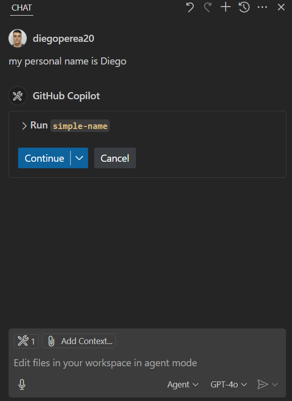
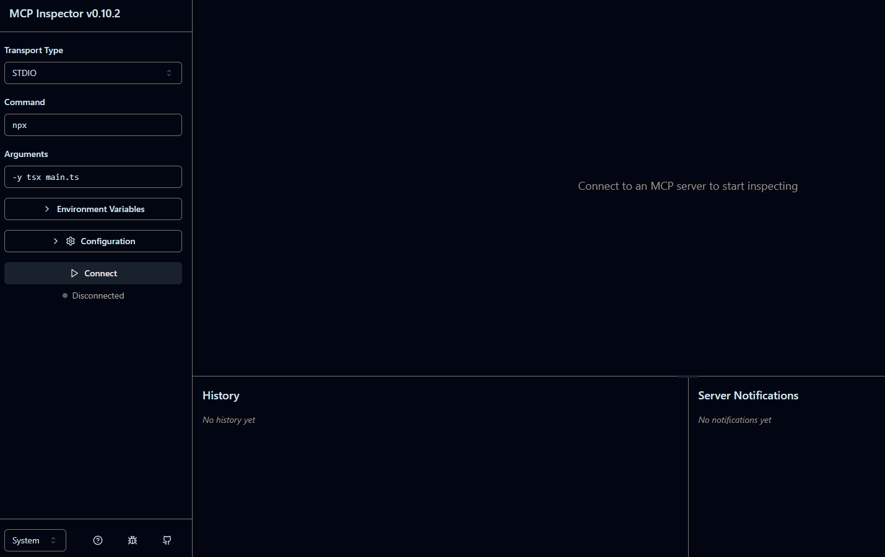
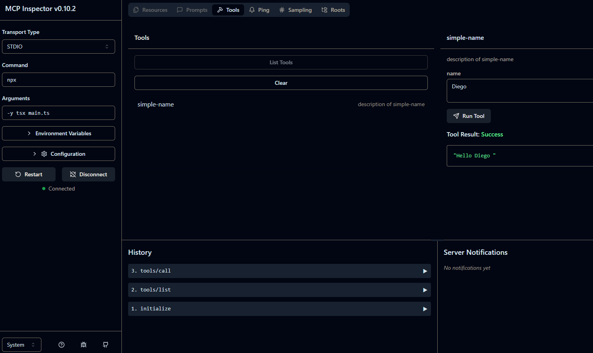
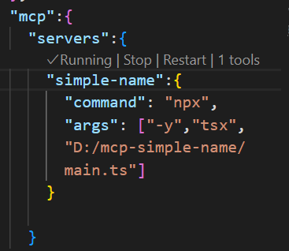

# MCP simple name in Vscode

MCP try with simple name 


<p align="center">
  
</p>

## 🛠️ Steps to Create from Scratch

### 1. Initialize your project

(download nodejs)
```bash
npm -y init
```

### 2. In your package.json, add the following:
```bash
"type": "module"
```
### 3 .📦 Install Dependencies

```python
npm install @modelcontextprotocol/sdk

#(Optional) Install zod for Validations
npm install zod
```


🔍 Using the MCP Inspector
You can verify your MCP project using the built-in inspector.

5. Run with Inspector

```bash
npx -y @modelcontextprotocol/inspector npx -y tsx main.ts
```
<p align="center">
  
</p>
<p align="center">
  
</p>

⚙️ VSCode Integration (Optional)
in workspace >settings.json

```bash
{
  "mcp": {
    "servers": {
      "simple-name": {
        "command": "npx",
        "args": ["-y", "tsx", "D:/mcp-simple-name/main.ts"]
      }
    }
  }
}
```

For stop MCP only push Stop
<p align="center">
  
</p>


-----

Created by [Diego Ivan Perea Montealegre](https://github.com/diegoperea20)
